# AXON — Smart Club Operations Platform

> Submission for the **AI Web Development Contest**, 9th DRMC International Tech Carnival 2026
> Theme: **Smart Club Operations**

**Live deployment:** _(see the Deployment URL section below)_
**Judges:** open **`/judge`** first — it maps every rubric requirement to the page that
demonstrates it, and offers one-click sign-in for all three roles.

---

## 1. Project name

**AXON — Smart Club Operations Platform**, built for the fictional **AXON Robotics Club**, the
robotics society of Dhaka Residential Model College.

An *axon* is the fibre that carries a signal from a neuron to a muscle — sense, decide, actuate,
which is the shape of every robot. Hence the club name and the tagline, *"Signals into motion."*

## 2. Project description

The brief opens with a specific complaint: club events lean on third-party tools like Google Forms,
and the result feels unprofessional. This platform replaces that whole arrangement.

An organisation runs many **fests**; each fest contains many **events**; each event has its **own
registration form that organisers compose themselves**. Participants browse fests, explore events,
register, and receive a QR ticket. Organisers create and manage events, build their registration
forms field by field, review and approve participants, export them, and check them in at the door
by scanning a phone.

The design goal was that **nothing important is enforced only in the browser**. Capacity limits,
registration deadlines and duplicate entries are all enforced inside a database transaction that
locks the event row, so two people racing for the last seat cannot both win it.

## 3. Features

### Fest directory
- Fest grid grouped into **Happening now / Upcoming / Past**, with status computed from the dates on
  every request rather than stored in a column — it cannot go stale and needs no cron job.
- Fest detail pages listing events **grouped by the day they run**, which is how someone actually
  plans a festival visit.
- Event cards carrying category, date and time, venue, fee, team size, a live **seats-remaining
  meter** and a **deadline countdown**.
- **Search** across event title, summary, description, category, venue and fest name, debounced so
  typing doesn't fire a request per keystroke.
- **Filters**: category chips with counts, fest, fee (free/paid), entry type (solo/team), and an
  open-for-registration-only toggle, plus four sort orders. Every control writes to the URL, so any
  filtered view is a shareable link that survives a reload and works with the back button.
- Event detail pages showing the full description, numbered rules, prize, venue, a live capacity
  meter, a ticking deadline countdown, and **the exact questions the form will ask** before you
  start filling it in.

### Registration system
- Account creation with **no confirmation email** in the way — you are signed in on submit.
- **Dynamically rendered registration forms.** Nine field types (short text, long text, email,
  phone, number, dropdown, single choice, checkboxes, URL). The form markup knows nothing about
  robots or quizzes; it only knows field types.
- Validation on the client **and again on the server**, with per-field error messages.
- Solo and team entry, with team mates added inline and team size checked against the event's own
  minimum and maximum.
- **Server-enforced limits**, all inside one transaction with a row lock on the event:
  - deadline checked against the database clock, not the browser's;
  - capacity counted inside the lock;
  - duplicates caught by a `unique (event_id, user_id)` constraint.
- **Waitlist with automatic promotion.** A full event queues entries with a visible position. Any
  cancellation or rejection that frees a seat promotes the queue head and renumbers the rest, in the
  same transaction — a freed seat and an un-promoted queue can never coexist.
- **Confirmation + QR ticket.** A unique code like `AXN-K4D-9PQ` and a QR pass encoding the check-in
  URL, so scanning it from any camera app lands an organiser on the verification screen.
- **Payment details captured on the registration itself** for paid events — method, transaction
  reference, paying number and referral code — so there is no second form and no spreadsheet to
  reconcile against the registration list.
- **My registrations**, grouped into upcoming, attended and cancelled, with ticket re-download and
  cancellation behind a deliberate confirmation step.

### Organizer management ("Mission Control")
- **Dashboard**: KPI tiles, a 30-day registration time series with a hover crosshair, a status
  breakdown strip, overall seat fill, and a list of events needing attention (nearly full, has a
  waitlist, or closing within four days).
- **Participants table**: all 470 registrations, paginated and sortable, with contact details, team
  composition, and every custom form answer in a collapsible panel.
- **Search** by name, email, phone, institution, ticket code or team name, with status / fest / event
  filters and four sort orders.
- **Status management**: approve, reject, waitlist, check in, cancel or reinstate — per row, or in
  bulk across a selection.
- **CSV export** of exactly the current filter selection, promoting every organiser-defined form
  field to its own column, with a UTF-8 BOM so Excel renders Bengali names correctly.
- **Event editor** with draft / published / cancelled visibility, and a guard that refuses to set a
  capacity below the seats already taken rather than silently overselling.
- **Registration form builder**: add, reorder and delete questions per event, with required flags
  and option lists. Reordering uses up/down buttons rather than drag-and-drop, deliberately — drag
  is unusable on a phone, and admin tooling has to work on a phone.
- **QR check-in scanner** with camera scanning, repeat-frame de-duplication, haptic feedback, a
  running session list, and **manual code entry that always works** — a door tool must not fail
  closed when a camera is unavailable.
- **Analytics**: registration velocity, category breakdown, a conversion funnel, and capacity by
  event.
- **Audit log** of every privileged mutation with its actor and timestamp.

### Event assistant
- A floating assistant answers questions about **dates, fees, deadlines, seats left, team sizes,
  prizes, categories, festivals and how to register**, reading live rows rather than a canned script.
- Deterministic by design — see the AI disclosure below. It is labelled in the UI as not being a
  language model.

### Throughout
- **Dark-first design** in near-black azure with a light theme available from the
  toggle. Dark is the unconditional default rather than inferred from the OS — a deliberate choice,
  so the identity is the same for everyone — and there is no flash on load.
- **Fully responsive**, including the admin: the participants table becomes cards under 768px.
- **Animated hero** — an ambient particle field and an orbital system drawn on canvas, plus a
  typed subheading. All three honour `prefers-reduced-motion`, pause when scrolled out of view, and
  cap device pixel ratio, so they cost almost nothing on a phone.
- **Generated SVG artwork** — all 16 event posters and 4 fest banners are drawn deterministically
  from each record's art seed and category, in eight motifs drawn from each discipline's visual
  vocabulary. About 2KB each, theme-aware, and no image requests at all.
- Accessibility: native controls restyled rather than replaced, real labels on every field, visible
  focus rings, `prefers-reduced-motion` respected, and status always carried by text as well as
  colour.

### Design notes

- **Dark-first, border-led.** Depth comes from hairlines rather than shadows, which keeps the
  interface flat and dense — closer to an instrument panel than a marketing page.
- **The hero does something.** Instead of a decorative banner it carries a live status line, the
  thesis as a headline, and a working event search, so the first element on the page is functional.
- **The status palette was computed, not chosen by eye.** An orange brand accent sits in the same
  hue family as a conventional amber "warning" and red "error", so those were re-stepped to pure
  yellow and magenta-red and re-validated for contrast and colour-blind separation. The one pair
  no palette can fix — success-green against error-red under deuteranopia — is why every status in
  this app also carries a text label and never relies on colour alone.

## 4. Tech stack

| Layer | Choice | Why |
|---|---|---|
| Framework | **Next.js 16** (App Router), React 19 | Server Components keep database queries on the server; Server Functions remove the need for a separate API layer |
| Language | **TypeScript** (strict) | The whole project typechecks with zero errors |
| Styling | **Tailwind CSS v4** + a token layer | Semantic CSS custom properties flip per theme, so no component needs a `dark:` variant and the whole palette is swappable from one file |
| Database | **PostgreSQL** (Supabase) | Real transactions and row locks, which the capacity rule depends on |
| DB client | **postgres.js** | Tagged-template SQL — readable in review, parameterised by construction |
| Auth | Hand-rolled: **jose** (JWT) + **bcryptjs** | No email-verification wall between a judge and the app, and authorization readable in one file |
| Validation | **Zod** | One schema used by both the client and the server |
| QR | **qrcode** (generate) + **html5-qrcode** (scan) | Server-rendered SVG passes; camera decoding in the browser |
| Charts | Hand-written SVG | No charting library; full control of marks, and nothing to fight over theming |
| Hosting | **Vercel** | Zero-config deploys from GitHub |

**No paid services are used.** Every dependency is open source and every platform used sits on a
free tier.

## 5. Setup instructions

```bash
# 1. Clone and install
git clone https://github.com/Imran0604/AXON_RoboticsClub.git
cd AXON_RoboticsClub
npm install

# 2. Configure
cp .env.example .env.local
# Then edit .env.local and set:
#   DATABASE_URL     — Supabase → Project Settings → Database → Connection string
#                      → "Transaction pooler" tab (port 6543)
#   SESSION_SECRET   — node -e "console.log(require('crypto').randomBytes(32).toString('hex'))"

# 3. Create the schema and load the sample data
npm run db:setup

# 4. Run
npm run dev          # http://localhost:3000
```

`npm run db:setup` applies `supabase/schema.sql` then `supabase/seed.sql` and prints a row count. It
is safe to re-run — both files are idempotent. If you would rather not use the CLI, paste those two
files into the Supabase SQL Editor instead, schema first.

To regenerate the sample data (for example to change its size or shape), edit
`scripts/generate-seed.mjs` and run `npm run db:seed`. The generator is deterministic, so the
committed `seed.sql` stays reviewable in a diff.

## 6. Deployment URL

**https://axon-robotics-club.vercel.app**

The database is hosted on Supabase and will remain available through the evaluation period.

## 7. Demo credentials

The sign-in page has **one-click buttons for all three roles** — no typing required. To sign in
manually, the password for all three accounts is `axon1234`:

| Role | Email | Password | What it demonstrates |
|---|---|---|---|
| Participant | `student@axon.club` | `axon1234` | Registering, tickets, My registrations. Pre-loaded with a registration in **every** status — confirmed, waitlisted, pending and checked-in |
| Organizer | `organizer@axon.club` | `axon1234` | Mission Control, participants, form builder, scanner |
| Admin | `admin@axon.club` | `axon1234` | Everything, plus the audit log |

There is no email verification step on any account, including ones you create yourself.

## 8. Third-party services / APIs

| Service | Used for | Tier |
|---|---|---|
| **Supabase** | PostgreSQL database | Free |
| **Vercel** | Hosting and deployment | Free (Hobby) |
| **Google Fonts** | Archivo and IBM Plex Mono, self-hosted at build time via `next/font` | Free |

No analytics, trackers, payment processors or external image hosts. The app makes no outbound
network requests at runtime beyond its own database.

## 9. AI tools / features used

Disclosed in full, as the rules require.

**AI used to build the project**

- **Claude Code** (Claude Opus 5, Anthropic) — used as the primary development tool for this
  submission: database schema design, the seed-data generator, all application code, the design
  system, and this README. Development was directed and reviewed by the author throughout.
- No other AI coding assistant was used.

**AI used for assets**

- **None.** All artwork in the project — the AXON logo, the 16 event posters, the 4 fest banners,
  the empty-state illustration and every icon — is **hand-authored SVG, generated
  deterministically in code**. No image-generation model was used, and no raster image ships with
  the app.

**AI features inside the product**

- **No language model is used at runtime, and the product does not claim one.** There is an **event
  assistant** in the bottom-right corner that answers questions about event dates, fees, deadlines,
  seats remaining, team sizes, prizes and how registration works — but it is a *deterministic
  lookup*, not a chatbot. It classifies a question against a fixed set of intents, resolves any
  event named in it, and answers from live database rows. The panel header says
  "Reads the live event data · not a language model" so nobody is misled.
- This was a deliberate trade. Wiring up an LLM would have needed a paid API key the project does
  not have, and a feature that dies when a free quota runs out is worse than no feature. The
  trade-off is honest: the assistant cannot hold a conversation, but it never invents an event that
  does not exist, never quotes a stale price, and never goes down.

## 10. Screenshots

Captured from the live deployment with `node scripts/screenshots.mjs <url>`, which drives a real
Chrome via `puppeteer-core` and mints a session cookie for the signed-in views. Re-runnable, so
these never drift from what is actually deployed.

### Home

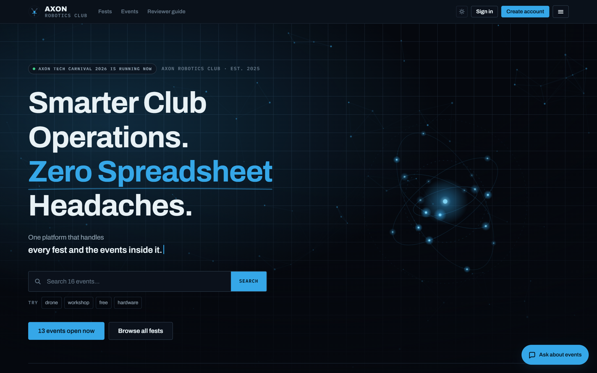

The hero carries a live status line, a typed subheading, a working event search, and an ambient
particle field with an orbital system — all drawn on canvas, with no hero image to download.

### Browsing and registering

| Fest directory | Event directory, filtered |
|---|---|
| 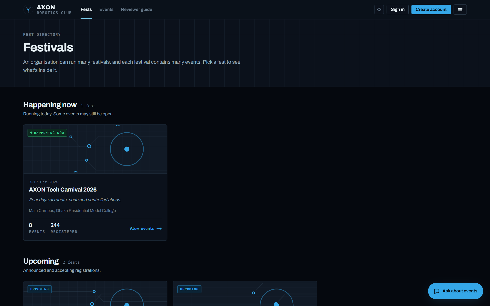 | 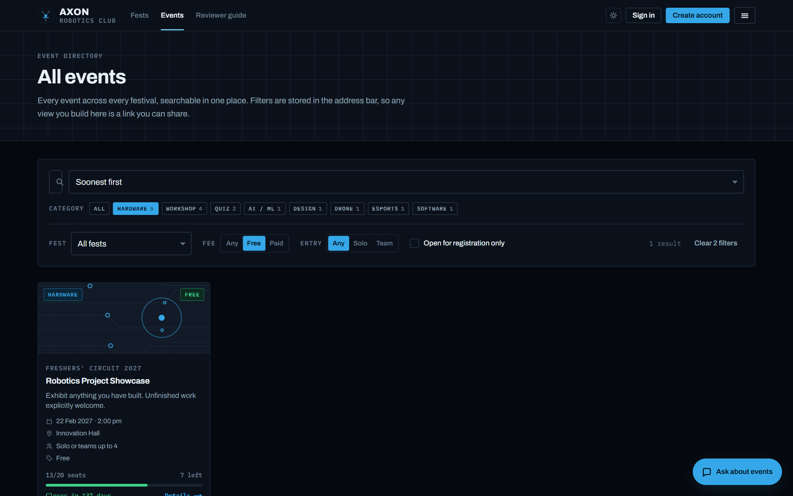 |
| Grouped into happening now / upcoming / past, computed from dates. | Category + fee filters combined, with the state held in the URL. |

| Event detail | Registration form |
|---|---|
| 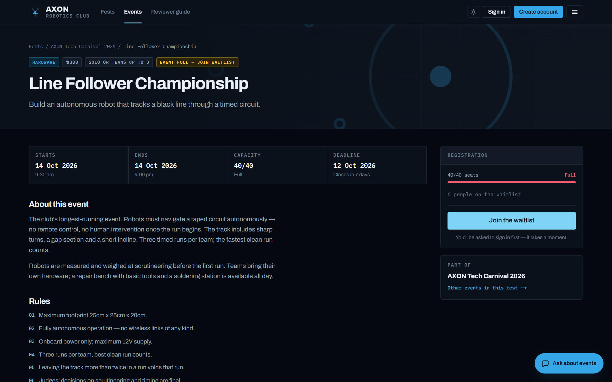 | 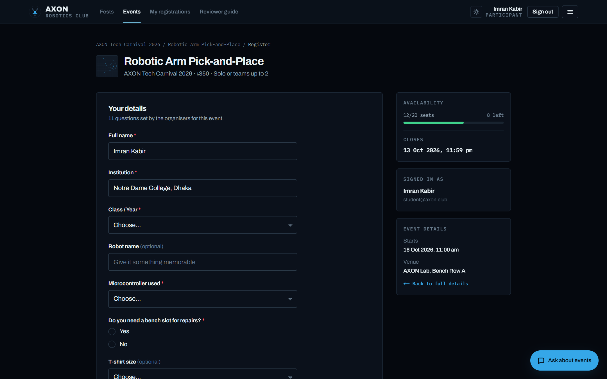 |
| Live capacity meter, deadline countdown, rules, and the questions the form will ask. | Rendered from organiser-defined fields, including payment details on paid events. |

| QR ticket | Event assistant |
|---|---|
| 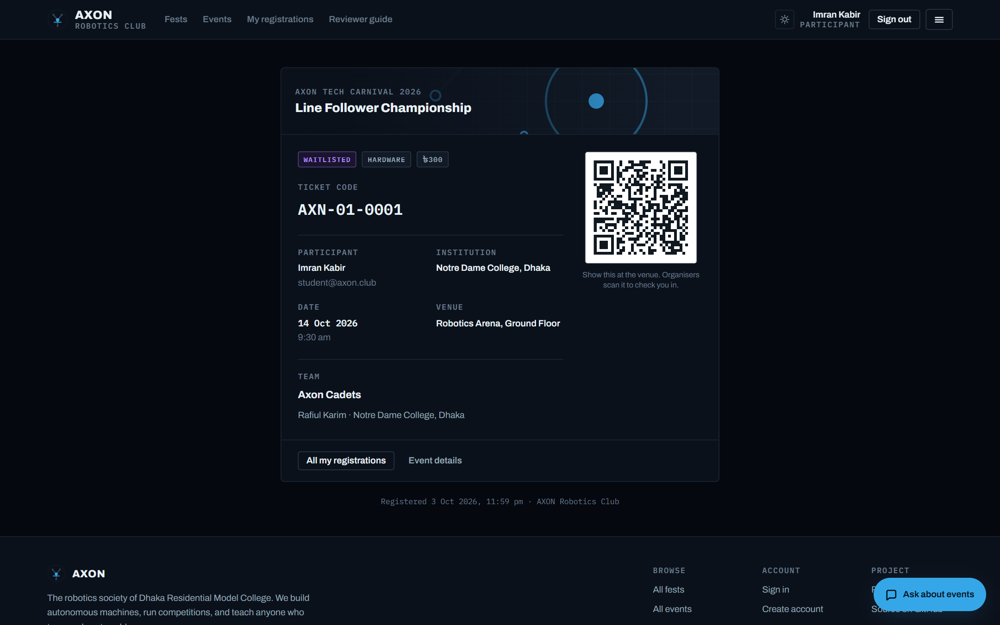 | 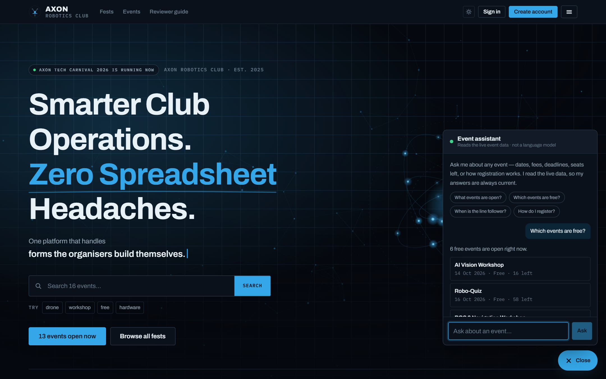 |
| Unique code and a scannable pass encoding the check-in URL. | Answers from live data. Labelled in the UI as not being a language model. |

### Organiser tooling

| Mission Control | Participants |
|---|---|
| 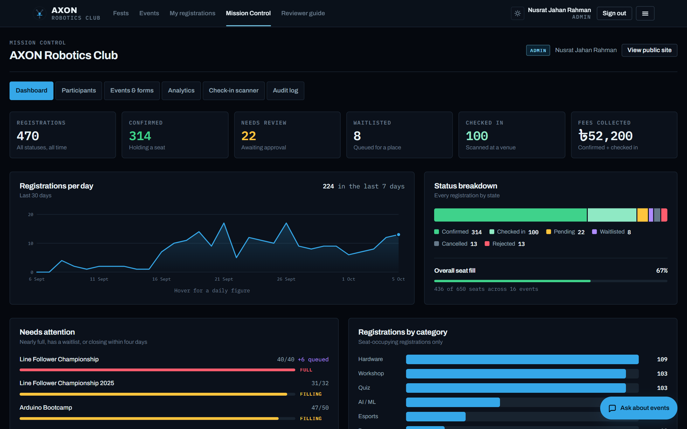 | 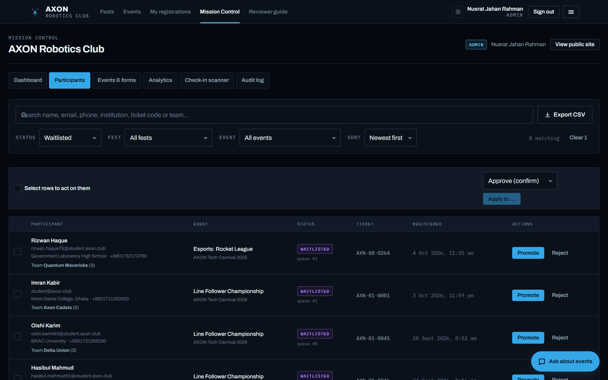 |
| KPI tiles, a 30-day time series, status breakdown and an attention list. | 470 registrations, searchable and filterable, with bulk status actions. |

| Registration form builder | Check-in scanner |
|---|---|
| 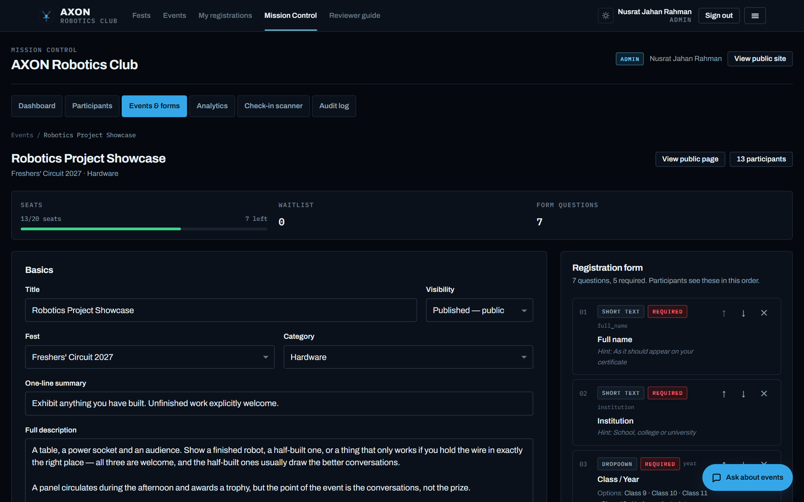 | 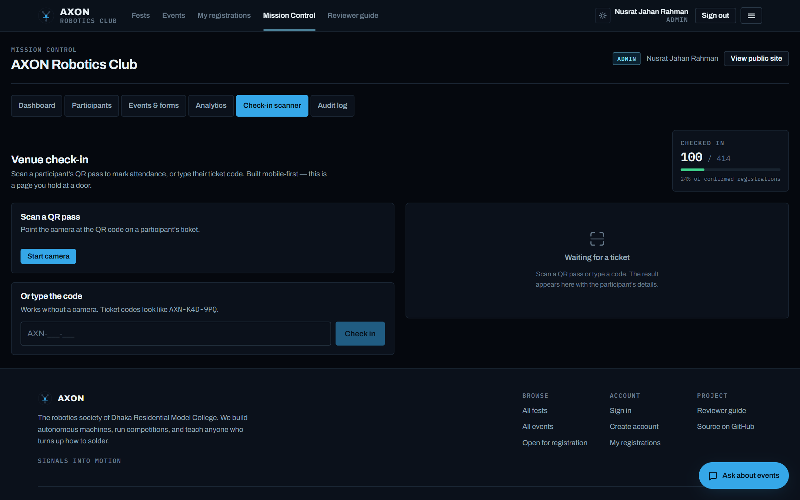 |
| Nine field types, required flags, option lists, reorderable. | Camera scanning with manual code entry as a fallback that always works. |

### Responsive and theming

| Mobile — events | Mobile — admin | Light theme |
|---|---|---|
| 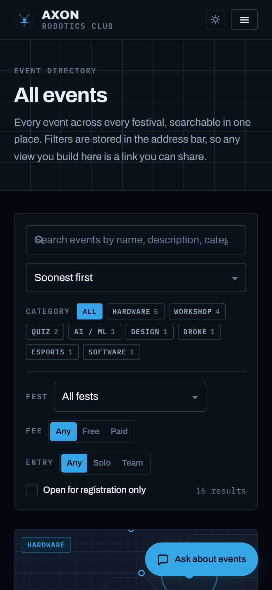 | 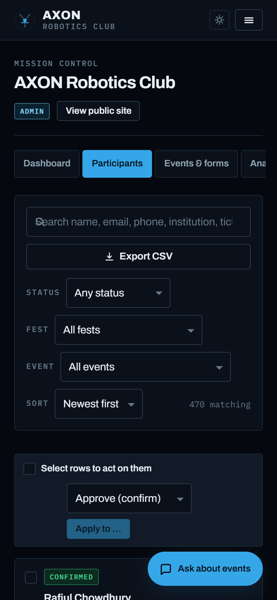 | 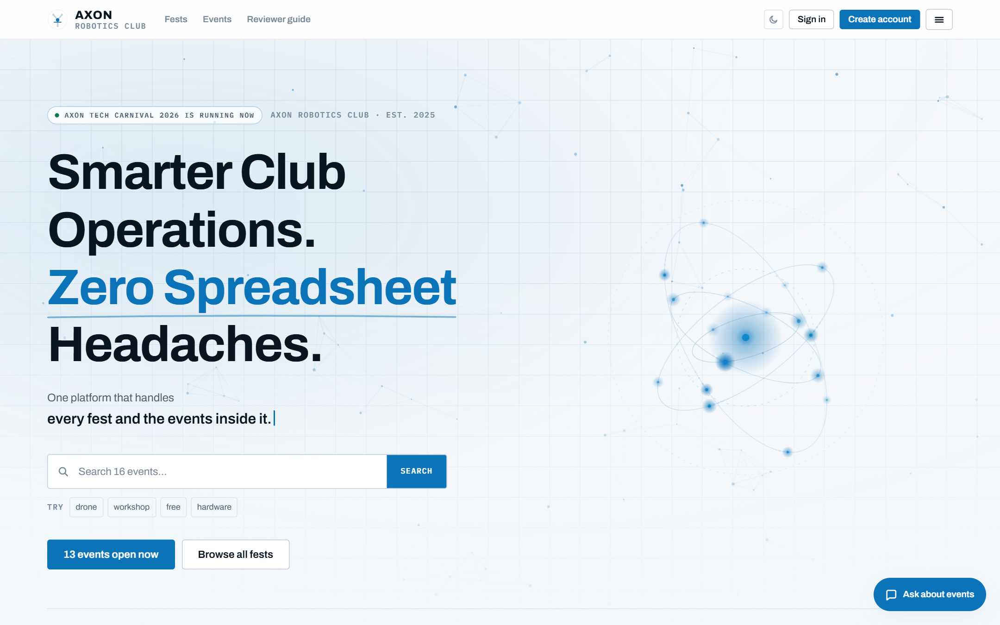 |
| 390px wide. | The participants table becomes cards under 768px. | Dark is the default; light is an opt-in on the toggle. |

### Reviewer guide

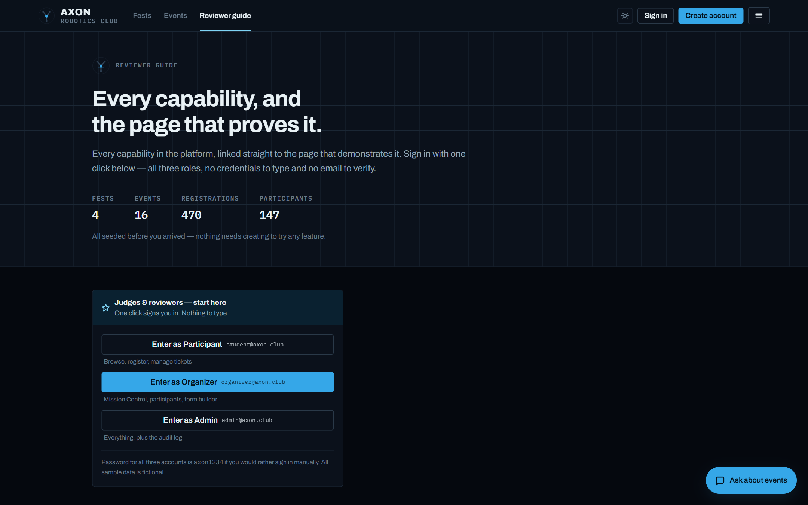

Every capability linked to the page that demonstrates it, with one-click sign-in for all three roles.

## 11. Known limitations

Stated plainly rather than hidden.

- **No transactional email.** Confirmations and waitlist promotions are shown in the app but not
  emailed. Adding it would have meant another third-party account; the ticket page and My
  registrations carry the same information.
- **Payment is recorded, not charged.** Paid events collect the payment method (bKash, Nagad,
  Rocket, bank transfer, card or cash on arrival), a transaction reference and the paying number,
  and organisers see all of it in the participants table and the CSV export. But no gateway is
  integrated, so nothing is actually debited and nothing is automatically verified — an organiser
  still confirms each reference against their own statement. Doing it this way keeps payment on the
  registration record instead of in a separate spreadsheet, which is the part that actually causes
  reconciliation pain.
- **No certificate generation** for attendees.
- **No real-time updates.** Seat counts are correct on every page load, but an open page does not
  live-update when someone else registers. Capacity is still enforced correctly at submission.
- **The waitlist promotes silently.** A promoted participant sees their new status next time they
  look, rather than being notified — a consequence of having no email.
- **The QR scanner needs HTTPS and camera permission.** It works on the deployed site and on
  localhost, but not over plain HTTP on a LAN address. Manual code entry is always available as a
  fallback.
- **Single organisation.** The schema is genuinely multi-tenant (`organizations → fests → events`)
  but the UI only ever shows one organisation; there is no org-switcher.
- **Fest creation is not in the UI.** Events have a full editor, but fests are seeded via SQL. The
  rubric asks for event and registration management, so the editor effort went there.
- **No automated test suite.** Core logic was verified with an integration script against the live
  database (capacity accounting, the duplicate constraint, and waitlist promotion — 9 assertions,
  all passing), but there is no committed test runner.

## 12. License

**MIT** — see [LICENSE](./LICENSE).

All sample data is fictional. Participant names, institutions, emails and phone numbers in the seed
data were generated for demonstration and belong to no real person.

## 13. Rule interpretation

The organising authority reserves the right to make the final decision regarding rule
interpretation, eligibility, judging, scoring, and any matters not explicitly covered in the contest
guidelines. All decisions made by the judging panel and the organising authority are final.

---

<div align="center">

**AXON Robotics Club** · *Signals into motion*
Built for the 9th DRMC International Tech Carnival 2026

</div>
